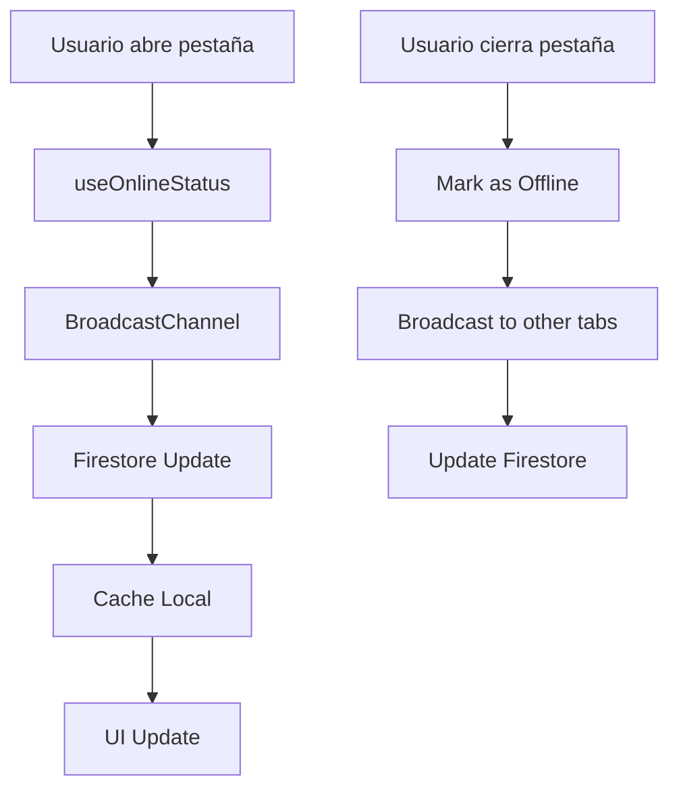
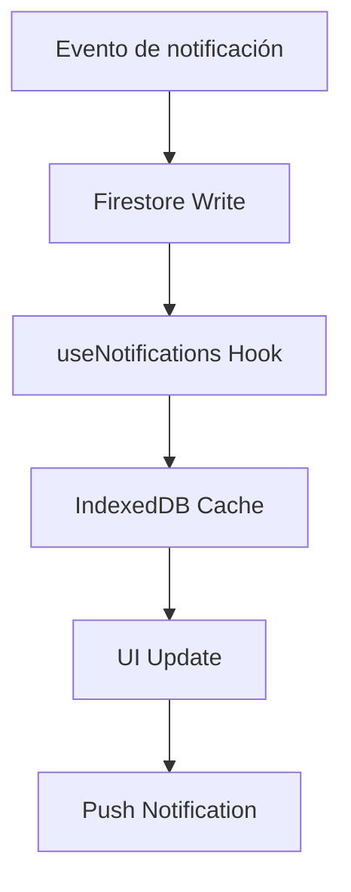

# Sistema de Estado Online/Offline y Notificaciones

## 📋 Resumen Ejecutivo

Este documento describe el sistema completo de gestión de estado online/offline y notificaciones implementado en la aplicación. El sistema proporciona:

- ✅ **Persistencia de estado manual** a través de logouts
- ✅ **Sincronización multi-dispositivo** usando BroadcastChannel
- ✅ **Reflexión en tiempo real** del estado de usuarios
- ✅ **Integración con estado de oficina** y geolocalización
- ✅ **Optimizaciones de performance** con debouncing y cache offline
- ✅ **Sistema de notificaciones TTL** con limpieza automática
- ✅ **Cache offline** con IndexedDB para notificaciones
- ✅ **Push notifications** con Firebase Cloud Messaging
- ✅ **Virtualización** para listas de notificaciones
- ✅ **Grouping inteligente** de notificaciones por tipo

## 🏗️ Arquitectura del Sistema

### Componentes Principales

#### 1. **Hooks de Estado**
- `useOnlineStatus.ts` - Gestión principal del estado online/offline
- `useOfficeStatusSync.ts` - Sincronización con estado de oficina
- `useUsersSync.ts` - Sincronización de usuarios en tiempo real
- `useNotifications.ts` - Gestión de notificaciones con cache offline
- `usePushNotifications.ts` - Push notifications con FCM

#### 2. **Stores (Zustand)**
- `dataStore.ts` - Estado global de usuarios y datos
- `chunkStore.ts` - Gestión de chunks de mensajes

#### 3. **Componentes UI**
- `UserAvatar.tsx` - Avatar con indicador de estado
- `NotificationDropdown.tsx` - Dropdown con virtualización
- `ChatSidebar.tsx` - Sidebar con sincronización en tiempo real

#### 4. **APIs y Utilidades**
- `/api/clean-notifications` - Limpieza automática de notificaciones
- `taskUtils.ts` - Utilidades para tareas
- `firebase.ts` - Configuración de Firebase con FCM

## 🔄 Flujo de Datos

### Estado Online/Offline



### Notificaciones



## 📁 Estructura de Archivos

### Hooks
```
src/hooks/
├── useOnlineStatus.ts          # Estado online/offline principal
├── useOfficeStatusSync.ts      # Sincronización con oficina
├── useUsersSync.ts            # Sincronización de usuarios
├── useNotifications.ts        # Gestión de notificaciones
└── usePushNotifications.ts    # Push notifications
```

### Stores
```
src/stores/
├── dataStore.ts              # Estado global
└── chunkStore.ts            # Gestión de chunks
```

### Componentes
```
src/components/
├── ui/
│   ├── UserAvatar.tsx        # Avatar con estado
│   ├── NotificationDropdown.tsx # Dropdown virtualizado
│   └── LoadMoreButton.tsx    # Botón de carga
└── ChatSidebar.tsx          # Sidebar principal
```

### APIs
```
src/app/api/
└── clean-notifications/
    └── route.ts             # Limpieza automática
```

## ⚙️ Configuración

### Variables de Entorno
```env
# Firebase
NEXT_PUBLIC_FIREBASE_API_KEY=your_api_key
NEXT_PUBLIC_FIREBASE_AUTH_DOMAIN=your_domain
NEXT_PUBLIC_FIREBASE_PROJECT_ID=your_project_id

# FCM (Opcional)
NEXT_PUBLIC_FCM_VAPID_KEY=your_vapid_key
```

### Configuración de Performance
```typescript
const PERFORMANCE_CONFIG = {
  DEBOUNCE_DELAY: 10 * 60 * 1000, // 10 minutos
  HEARTBEAT_INTERVAL: 60 * 1000,   // 1 minuto
  MAX_RETRY_ATTEMPTS: 3,
  RETRY_DELAY: 2000,               // 2 segundos
};
```

## 🚀 Características Implementadas

### ✅ 1. Persistencia de Estado Manual
- Campo `lastManualStatus` en Firestore
- Persiste a través de logouts y reinicios
- Script de migración incluido

### ✅ 2. Sincronización Multi-Dispositivo
- BroadcastChannel para comunicación entre pestañas
- Fallback a localStorage
- Contador de pestañas activas

### ✅ 3. Reflexión en Tiempo Real
- Hook `useUsersSync` para sincronización
- Integración con Zustand store
- Actualizaciones automáticas en UI

### ✅ 4. Integración con Estado de Oficina
- Geolocalización para detectar ubicación
- Horarios de oficina configurables
- Sincronización automática de estado

### ✅ 5. Optimizaciones de Performance
- Debouncing de escrituras a Firestore
- Cache offline con localStorage
- Retry logic con backoff exponencial
- Memoización de funciones costosas

### ✅ 6. Sistema de Notificaciones TTL
- Campo `expiresAt` en notificaciones
- API de limpieza automática
- Configuración de Vercel cron jobs

### ✅ 7. Cache Offline
- IndexedDB para notificaciones
- Queue de acciones offline
- Sincronización automática al reconectar

### ✅ 8. Push Notifications
- Firebase Cloud Messaging
- Service Worker para manejo offline
- Permisos y tokens automáticos

### ✅ 9. Virtualización y UX
- React Window para listas grandes
- Grouping por tipo de notificación
- Swipe actions en móvil
- Animaciones optimizadas

### ✅ 10. Testing y Documentación
- Tests unitarios para hooks principales
- Documentación completa del sistema
- Guías de troubleshooting

## 🔧 Uso de los Hooks

### useOnlineStatus
```typescript
const { currentStatus, isOnline, updateStatus } = useOnlineStatus();

// Cambiar estado manualmente
await updateStatus('Ausente', true);

// Verificar si está online
console.log('Usuario online:', isOnline);
```

### useNotifications
```typescript
const { 
  notifications, 
  markNotificationAsRead, 
  deleteNotification,
  isLoading 
} = useNotifications();

// Marcar como leída
await markNotificationAsRead(notificationId);

// Eliminar notificación
await deleteNotification(notificationId);
```

### usePushNotifications
```typescript
const {
  isSupported,
  isSubscribed,
  requestPermission,
  unsubscribe
} = usePushNotifications();

// Solicitar permisos
const granted = await requestPermission();

// Desuscribirse
await unsubscribe();
```

## 🧪 Testing

### Tests Unitarios
```bash
# Ejecutar tests
npm test

# Tests específicos
npm test -- --testNamePattern="useOnlineStatus"
```

### Tests de Integración
```bash
# Tests de componentes
npm run test:components

# Tests de hooks
npm run test:hooks
```

## 🐛 Troubleshooting

### Problemas Comunes

#### 1. Estado no se actualiza
```typescript
// Verificar conexión a Firestore
console.log('Firestore connection:', db);

// Verificar usuario
console.log('User:', user?.id);
```

#### 2. Notificaciones no aparecen
```typescript
// Verificar permisos
console.log('Notification permission:', Notification.permission);

// Verificar FCM
console.log('FCM supported:', messaging);
```

#### 3. Performance lenta
```typescript
// Verificar virtualización
console.log('List items:', itemCount);

// Verificar cache
console.log('Cache size:', await caches.keys());
```

### Debug Mode
```typescript
// Habilitar logs detallados
localStorage.setItem('debug', 'true');

// Ver logs en consola
console.log('[Debug] Status updates:', statusUpdates);
```

## 📊 Métricas y Monitoreo

### Métricas de Performance
- Tiempo de respuesta de Firestore
- Tamaño del cache offline
- Uso de memoria en listas virtualizadas
- Tasa de éxito de push notifications

### Métricas de UX
- Tiempo de carga de notificaciones
- Tasa de engagement con notificaciones
- Uso de estados manuales vs automáticos

## 🔮 Roadmap Futuro

### Próximas Mejoras
1. **WebRTC para comunicación peer-to-peer**
2. **Machine Learning para predicción de estados**
3. **Integración con calendarios externos**
4. **Notificaciones inteligentes basadas en contexto**
5. **Analytics avanzados de uso**

### Optimizaciones Técnicas
1. **Service Workers más avanzados**
2. **Compresión de datos offline**
3. **Sincronización diferencial**
4. **Cache inteligente con LRU**

## 📝 Changelog

### v2.0.0 (Actual)
- ✅ Persistencia de estado manual
- ✅ Sincronización multi-dispositivo
- ✅ Virtualización de listas
- ✅ Push notifications
- ✅ Cache offline completo

### v1.0.0
- Estado básico online/offline
- Notificaciones simples
- UI básica

## 🤝 Contribución

Para contribuir al sistema:

1. **Fork del repositorio**
2. **Crear feature branch**
3. **Implementar cambios**
4. **Agregar tests**
5. **Actualizar documentación**
6. **Crear Pull Request**

## 📞 Soporte

Para soporte técnico:
- 📧 Email: support@taskapp.com
- 📱 Slack: #status-system
- 📖 Docs: /docs/STATUS_SYSTEM.md

---

*Última actualización: Diciembre 2024* 